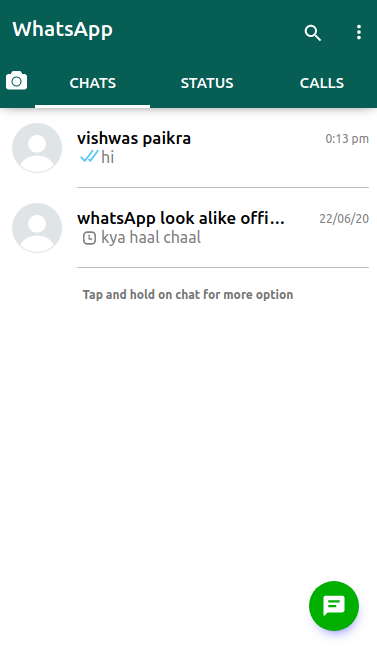

# WhatsApp Clone
Live link https://vishwaspaikra007.github.io/whatsapp-look-alike/
## Setup Instructions

1. Install NVM (Node Version Manager):
    <pre>
   nvm install 14
   nvm use 14
    </pre>

2. To run the React app:
   <pre>
   npm install
   npm run
  </pre>

3. By default, the React app fetches data from the server hosted on render.com. To change it to localhost, modify the \`config.js\` file present in the components folder.

## Server Configuration

The server requires the following environmental variables:

- \`DB_PATH\`
- \`GOOGLE_AUTH_PASSWORD_FOR_APPS\`
- \`PRODUCTION=true\`
- \`REFRESH_TOKEN_KEY\`
- \`TOKEN_KEY\`

## Features

- **Authentication:** The app handles authentication using email and password with Passport.js.

- **Message Storage:** All messages are stored in MongoDB.

- **Real-time Communication:** The app uses socket for real-time communication.

- **Contact List:** Users can add another registered user to the contact list, creating a new room for them.

- **Email Verification:** Emails are verified using OTP.

- **Message Seen Functionality:** Although not completely accurate, the app includes a message seen functionality.

- **New Message Notification:** When a new message arrives, a message count is shown in the respective chat box." > README.md

# 
